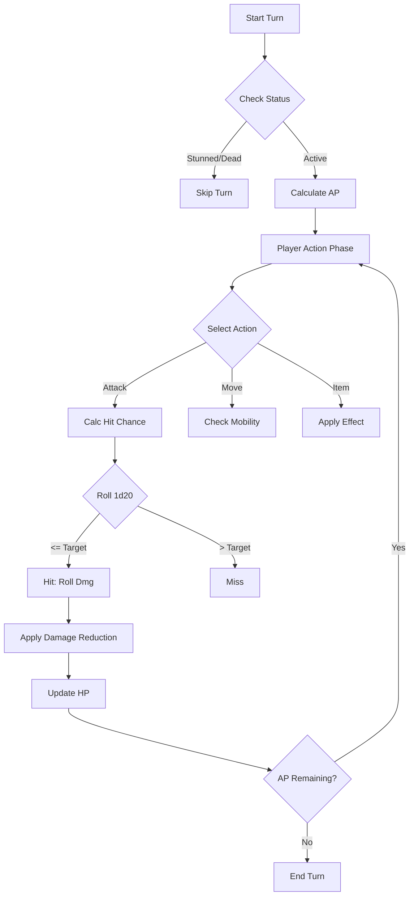

# HHSGame: Game Design Specification (GDS)

## 1. Executive Summary

This document serves as the authoritative Game Design Specification for *HHSGame*, a terminal-based roguelike RPG set in a post-apocalyptic world. The design philosophy emphasizes **Rule of Scarcity**: every resource—from ammunition to Action Points—must be meaningful. The game combines the tactical depth of traditional CRPGs with the unforgiving survival elements of roguelikes.

The core pillars are:
*   **Tactical Combat:** A grid-based system where positioning and Action Point (AP) management determine survival.
*   **Character Agency:** Attributes and Skills unlock unique dialogue, exploration paths, and tactical options.
*   **Reactive World:** Factions and environments respond to player reputation and history.

---

## 2. Core Attributes (基本属性)

### 2.1 Concept Definition & Design Intent
Attributes represent the raw biological and mental potential of a character. Unlike Skills, which can be trained, Attributes are largely static, defining the "hard limits" of a character's capabilities.
*   **Design Intent:** To force distinct character archetypes (e.g., the nimble thief vs. the brute soldier) at the start of the game, ensuring replayability.
*   **Mechanics:** Attributes range from **1 to 10** (default 5). Players start with **25 points** to distribute.

### 2.2 Attribute List

#### Strength (力量)
*   **Concept:** Raw physical power and muscle density.
*   **Mechanics:** Determines `Carry Capacity` and `Melee Damage`. Prerequisite for heavy weapons and Perks like *Strong Back*.

#### Perception (感知)
*   **Concept:** Environmental awareness and sensory acuity.
*   **Mechanics:** Determines `Initiative`, `Ranged Accuracy`, and the ability to spot traps or hidden loot.

#### Agility (敏捷)
*   **Concept:** Reflexes, balance, and coordination.
*   **Mechanics:** The primary driver for `Action Points (AP)` and `Evasion (Dodge)`. Critical for stealth builds.

#### Charisma (魅力)
*   **Concept:** Force of personality, appearance, and social intuition.
*   **Mechanics:** Influences `Barter` prices, `NPC Disposition`, and `Sanity Points (SP)`.

#### Intelligence (智力)
*   **Concept:** Cognitive processing speed, memory, and logical reasoning.
*   **Mechanics:** Determines `Skill Points` gained per level and unlocks complex crafting recipes.

### 2.3 The "Karma" Attribute (业力)
*   **Concept:** A measure of cosmic balance rather than random luck. A well-rounded character is "in tune" with the world.
*   **Design Intent:** To reward balanced builds and punish "min-maxing" (extreme dumping of stats).
*   **Mechanics:**
    *   **Formula:** `Karma` = **Median** of the 5 Core Attributes.
    *   *Calculation Example:* Str 8, Per 6, Agi 5, Cha 4, Int 4. Sorted List: `[4, 4, 5, 6, 8]`. Median is 5.
    *   **Impact:** Affects Critical Hit Chance and rare "Saving Throws" against environmental hazards.

---

## 3. Skills (技能)

### 3.1 Concept Definition & Design Intent
Skills represent learned expertise governed by a parent Attribute.
*   **Design Intent:** To allow granular character growth. While Attributes are static, Skills grow with Experience (XP).
*   **Mechanics:** Base Value = Parent Attribute. Max Value = 100.

### 3.2 Skill Categories

#### Strength Skills
*   **Melee (格斗):** Proficiency with hand-to-hand combat and melee weapons (bayonets, dao swords).
*   **Athletics (运动):** Running, climbing, swimming, and resisting physical hardship.
*   **Survival (生存):** Wilderness survival, foraging, and tracking.

#### Perception Skills
*   **Firearms (射术):** Proficiency with all ranged weapons.
*   **Awareness (警觉):** Spotting ambushes, hidden items, and detailed observation.
*   **Resolution (决心):** Mental fortitude, focus under pressure, and resisting fear/interrogation.

#### Agility Skills
*   **Stealth (潜行):** Moving silently and remaining undetected.
*   **Dexterity (灵巧):** Manual dexterity (lockpicking, reloading, disarming).
*   **Mechanics (机械):** Repairing weapons and operating machinery.

#### Charisma Skills
*   **Barter (交易):** Negotiation and trading prices.
*   **Leadership (领导):** Inspiring allies and organizing NPC effectiveness.
*   **Persuasion (说服):** Diplomacy, deception, or intimidation.

#### Intelligence Skills
*   **Knowledge (知识):** General lore, factions, history, and cultural nuances.
*   **Medicine (医疗):** First aid, treating wounds and diseases.
*   **Religion (宗教):** Understanding beliefs and gaining trust of communities.

### 3.3 Skill Synergies (Passive Bonuses)
High proficiency grants passive bonuses, rewarding specialization.
*   **Medicine (Lv 50+):** Stimpacks heal +20% more.
*   **Athletics (Lv 50+):** +1 Base AP.
*   **Melee (Lv 75+):** Unarmed attacks gain +2 Armor Penetration.
*   **Firearms (Lv 75+):** "Reload" action costs -1 AP.

> **Designer Note:** Future expansions should add synergies for every skill at thresholds 50, 75, and 100 to encourage deep specialization.

---

## 4. Game Mechanics

### 4.1 Resolution System (Checks and Rolls)
The game uses a **Roll-Under** system to determine success.
*   **Standard Check:** Roll `1d20` <= `Target Score`.
    *   **Attribute Check Target:** `Attribute * 2`
    *   **Skill Check Target:** `Attribute + Skill`
    *   **Critical Success:** Roll of 1 (Always succeeds, bonus effects).
    *   **Critical Failure:** Roll of 20 (Always fails, negative effects).

### 4.2 Dynamic Modifiers
Context determines difficulty. The equation is:
$$ \text{Effective Target} = (\text{Base Stat}) - \text{Penalties} + \text{Bonuses} $$

| Condition | Modifier | Context |
| :--- | :--- | :--- |
| **Range (Point Blank)** | +2 | Target is adjacent. |
| **Range (Optimal)** | 0 | Within weapon's ideal range. |
| **Range (Long)** | -5 | Beyond effective range. |
| **Partial Cover** | -3 | Target behind waist-high obstacle. |
| **Full Cover** | -6 | Target observing from corner/window. |
| **Dim Light** | -3 | Dusk or poor indoor lighting. |
| **Darkness** | -8 | Night or unlit cave (mitigated by Night Vision). |

### 4.3 Action Economy (AP)
Action Points (AP) represent the time budget for a turn.
*   **Calculation:** `Base AP = 5 + (Agility / 2)`.

#### Comprehensive AP Cost Table
| Action | Cost (AP) | Tactical Note |
| :--- | :--- | :--- |
| **Movement** | 1 | +1 cost if difficult terrain (mud, rubble). |
| **Stance Change** | 2 | Crouch (Gain Cover) or Stand (Run speed). |
| **Melee (Light)** | 3 | Knives, fast strikes. |
| **Melee (Heavy)** | 5 | Sledgehammers, wind-up attacks. |
| **Ranged (Snap)** | 3 | Pistol/SMG quick fire. |
| **Ranged (Aimed)** | 5 | Rifle/Sniper precise shot. |
| **Burst Fire** | 6 | Automatic weapons only (AOE/Multi-hit). |
| **Reload** | 2-4 | Mag vs. Shell reloading. |
| **Throw** | 4 | Grenades or Rocks. |
| **Inventory** | 4 | High cost simulates rummaging in backpack. |

**Defensive Reserve:** Unspent AP at turn end converts to **Evasion** (1 AP = +1 AC) for the enemy phase. This allows players to "wait and defend."

---

## 5. Combat Architecture

### 5.1 Combat Logic Flow

### 5.2 Derived Statistics
Calculated values derived from Core Attributes.

*   **Hit Points (HP):** `20 + (Strength * 2) + Athletics Skill`
*   **Sanity Points (SP):** `(Charisma + Resolution Skill) * 2`. Represents mental resilience against horror/stress.
*   **Carry Capacity:** `Strength * 10` kg. Exceeding this causes `Overburdened` (AP penalty).
*   **Initiative:** `Perception + Dexterity Skill`. Higher acts first.
*   **Armor Value (AV):** Flat damage reduction.

### 5.3 Damage Calculation
The damage pipeline prioritizes penetration logic.
$$ \text{Effective Damage} = \max(1, \text{Raw Damage} - \max(0, \text{AV} - \text{Weapon Penetration})) $$

**Example:**
*   **Weapon:** Assault Rifle (Dmg 10, Pen 3)
*   **Target:** Power Armor (AV 8)
*   **Calculation:**
    1.  Effective Armor = $\max(0, 8 - 3) = 5$
    2.  Damage Taken = $10 - 5 = 5$

---

## 6. Character Progression

### 6.1 Leveling Mechanics
*   **Experience (XP):** `XP Required = 100 * (Current Level)^1.5`
*   **Skill Points:** `10 + (Intelligence / 2)` per level.
*   **Caps:**
    *   **Soft Cap:** `Level * 5 + 20` (prevents early maxing).
    *   **Hard Cap:** 100.

| Level | Total XP | Rewards |
| :--- | :--- | :--- |
| 1 | 0 | Start |
| 2 | 100 | +Skill Points, +Trait Choice |
| 3 | 280 | +Skill Points |
| 4 | 520 | +Skill Points |
| 5 | 1100 | +Skill Points, +Perk Choice |

---

## 7. Survival & Economy

### 7.1 Recovery Systems
In a survival setting, health does not regenerate automatically.
*   **Short Rest (1h):** Restores 10% HP. Costs 1 Ration + Water.
*   **Long Rest (8h):** Restores 50% HP & 100% SP. Requires Shelter + 2 Rations + Water.
*   **Medical Treatment:**
    *   **First Aid (Skill):** Heals `Medicine / 4` HP. Cooldown: Once per wound.
    *   **Surgery:** Needed for "Crippled Limb" status.

### 7.2 Economic Exchange
**Currency:** Old World Cash (Fiat) and Trade Goods.
**Barter Formula:**
*   **Buy Price:** $\text{Base} \times (1.5 - (\text{Barter} \times 0.02))$
*   **Sell Price:** $\text{Base} \times (0.3 + (\text{Barter} \times 0.02))$

> **Extension Guide:** Designers can add "Regional Inflation" modifiers where specific goods (e.g., Water in a desert) have a `x2.0` value multiplier.

---

## 8. Reputation & Factions

### 8.1 Reputation Scale (声望)
Range: **-10 (Hated)** to **10 (Idolized)**.

| Tier | Range | Effect |
| :--- | :--- | :--- |
| **Hated** | -10 | Kill on sight. Faction sends hit-squads. |
| **Hostile** | -9 to -7 | Attack on sight unless outgunned. |
| **Neutral** | 0 | Standard prices. No access to restricted areas. |
| **Friendly** | 4 to 6 | 5% Discount. Unlocks Tier 1 Tasks. |
| **Ally** | 7 to 9 | Unlocks Faction Safehouse & unique Perks. |

### 8.2 Faction Perks
Unique bonuses unlocked by reaching reputation thresholds.

*   **Military (Army Remnants)**
    *   *Friendly:* **Standard Issue** - Loot +20% ammo in military crates.
    *   *Ally:* **Tactical Superiority** - +1 Accuracy with Rifles; +5% Combat XP.
*   **Merchants (Trade Union)**
    *   *Friendly:* **Preferred Customer** - Buy prices -5% (stacks).
    *   *Ally:* **Caravan Master** - Carry Capacity +15kg.
*   **Outlaws (Raider Clans)**
    *   *Friendly:* **Streetwise** - Intimidation +2 effective skill.
    *   *Ally:* **Dirty Fighting** - Melee attacks: 10% chance to Blind.
*   **Cultists (The Awakened)**
    *   *Friendly:* **Open Mind** - +10 Max Sanity Points (SP).
    *   *Ally:* **Martyr's Blood** - Auto-heal 25 HP when dropping below 20% HP (1/day).

---

## 9. Perks & Traits (Specialization)

### 9.1 Traits (特质)
**Concept:** Innate characteristics defined at birth/creation. They follow the "Flaw" design pattern: a significant benefit paired with a significant penalty.
*   **Design Intent:** To create "perfectly imperfect" characters and varied playstyles.

| Trait | Benefit | Drawback |
| :--- | :--- | :--- |
| **Small Frame** | +1 Agility | -25% Limb Health (easiers to cripple). |
| **Heavy Handed** | +4 Melee Dmg | -20% Critical Hit Damage. |
| **Four Eyes** | +1 Per (w/ glasses) | -2 Per (w/o glasses). |
| **Lone Wolf** | +10% XP (Solo) | -1 Cha per ally in party. |
| **Claustrophobia** | +1 Stats (Outdoors) | -1 Stats (Indoors). |

### 9.2 Adaptive Traits (Gameplay-Driven)
**Concept:** Traits earned dynamically based on player history.
*   **Bullet Shy:** Take >50% HP dmg from guns in one fight -> **+2 Perception** but **+20% Incoming Ranged Dmg**.
*   **Scarred Hide:** Accumulate 1000 dmg taken -> **+2 Armor Value** but **-1 Agility** (Stiff joints).
*   **Pyromaniac:** Kill 20 enemies with fire -> **+1 Explosion Radius** but **Compulsion** (Must use explosives if equipped).

### 9.3 Perks (天赋)
**Concept:** Positive-only abilities gained every 3 levels.
*   **Mechanics:** Require specific attribute thresholds.
*   **Sniper:** Hit chance x2 at Long Range. (Req: Per 6, Firearms 40).
*   **Action Boy/Girl:** +2 Max AP. (Req: Agi 6).
*   **Strong Back:** +20kg Carry Capacity. (Req: Str 5).
*   **Field Medic:** Medkits cost -1 AP. (Req: Medicine 40).
*   **Slayer (Lv 12):** All Melee attacks Crit on 1-2. (Req: Str 8).
*   **Grim Reaper's Sprint (Lv 12):** Kill restores 5 AP. (Req: Agi 8).

